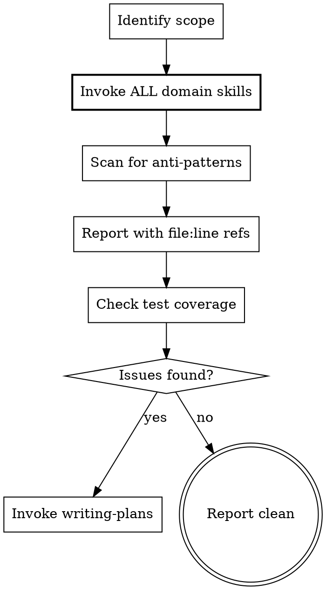

# Code Audit — Existing Feature Review

Use this instead of brainstorming when the feature already exists and needs review, testing, or both.

<HARD-GATE>
You MUST invoke ALL **available** relevant domain skills using the Skill tool BEFORE scanning code. Their anti-pattern tables ARE your audit checklist.

**Conditional on availability:** Check the system-reminder skill list first. If a domain skill is present (e.g. `ntdst-architecture`, `ntdst-data`, `ntdst-yootheme` from netdust-wp; `statamic-build` from netdust-statamic), invoke it. If no stack-specific domain skill is loaded, fall back to the generic structural + test-coverage audit in Phase 2/4 below and note in the report which domain dimensions weren't checked.

**"Referencing skills from memory" is not loading them.** You must actually invoke the Skill tool for each relevant skill. This is how you get the current anti-pattern tables.
</HARD-GATE>

## Anti-Pattern: "I Know The Patterns Well Enough"

Every audit loads domain skills. A "quick sanity check", a "simple review", a "pre-go-live audit" — all of them. Your memory of patterns is incomplete. The anti-pattern tables in domain skills are comprehensive and up-to-date. The audit can be fast (one grep per anti-pattern), but you MUST use the domain skills as your checklist.

**Skipping domain skill loading because you "know the patterns" is the #1 audit failure mode.**

## When To Use

- Reviewing code that was implemented without domain skill guidance
- Adding tests to existing untested features
- Pre-launch audit of a feature or service
- After refactoring, verify patterns are still correct
- "Does this code follow our conventions?"
- "Just a sanity check" or "quick review" requests

## Checklist

You MUST create a task for each of these items and complete them in order:

1. **Identify scope** — which files, services, or features to audit
2. **Invoke domain skills** — load ALL relevant domain skills (architecture, data, yootheme, infra). Their anti-pattern tables become your checklist.
3. **Scan code** — grep for anti-patterns, check service structure, verify conventions
4. **Report findings** — severity-ranked issues with `file.php:123` references
5. **Check test coverage** — do unit and acceptance tests exist for critical paths?
6. **Generate remediation plan** — invoke writing-plans for fixes, include verification stages
7. **Execute or hand off** — fix now or save plan for later

## Process Flow



**The bold step is mandatory.** Do NOT proceed to scanning without loading domain skills first.

## Scan Process

### Phase 1: Load Domain Skills (REQUIRED)

Before reading ANY code, invoke these skills based on relevance:

| Code Type | Skills to Load (if available) |
|-----------|----------------|
| WP PHP services | ntdst-architecture (netdust-wp) |
| WP data models, CRUD, API | ntdst-data (netdust-wp) |
| YOOtheme sources | ntdst-yootheme (netdust-wp) |
| Statamic features, blocks | statamic-build (netdust-statamic) |
| Infrastructure, deployment | dev-stack (core), wp-infra (netdust-wp) |
| Any code (always) | testing-workflow (core) |

**Minimum:** Load `testing-workflow` for any code audit. Load the stack-specific architecture skill if available (`ntdst-architecture` for WP, `statamic-build` for Statamic). If neither is loaded, audit the generic dimensions (structure, tests, anti-patterns visible in the code) and call out that domain-specific anti-patterns weren't checked.

### Phase 2: Structural Audit

Check each service file for:
- Implements required interface? (`NTDST_Service_Meta`)
- Has `metadata()` with name, description, priority?
- Constructor calls `$this->init()`?
- Config via `apply_filters()`?
- Hooks only in `init()` or provider `boot()`?
- Size limits respected (~150 lines/class, ~20 lines/method)?

### Phase 3: Anti-Pattern Scan

Run grep checks from domain skill anti-pattern tables:

```bash
# Find scope first
find {path} -name "*.php" -type f

# Then scan — get patterns from domain skills you loaded
grep -rn 'pattern' --include="*.php" {path}
```

Let the domain skill anti-pattern tables tell you WHAT to grep for. Do not invent patterns.

### Phase 4: Test Coverage Audit

For each feature in scope:
- Do unit tests exist?
- Do acceptance tests exist?
- Are critical paths covered (happy path, error cases, edge cases)?
- Would a user hitting this feature in a browser encounter issues the tests don't catch?

## Report Format

```markdown
## Audit: {Feature/Service Name}

**Files reviewed:** {count}
**Domain skills used:** ntdst-architecture, ntdst-data, ...
**Critical:** {count} | **Warning:** {count} | **Info:** {count}

### Critical (must fix)
1. **{Issue}** — `path/file.php:123`
   Problem: {what's wrong}
   Fix: {what to do}

### Warning (should fix)
...

### Missing Tests
- {Scenario that has no test coverage}
...

### Passed Checks
- ✓ {What's correct}
...
```

**Note the `file.php:123` format.** Not "Line 123" or "around line 123".

## Transition to Remediation

After the report, generate a plan:

**If fixes needed:** Invoke writing-plans to create a remediation plan. Each critical/warning issue becomes a task. Verification stages (V1-V5) are mandatory at the end.

**If only tests missing:** Invoke writing-plans to create a test plan. Implementation tasks are the missing tests. Verification stages confirm they pass.

**If clean:** Report passes and note what was verified. No plan needed.

## Red Flags — STOP and Load Skills

- "I know the patterns well enough"
- "Just a quick sanity check"
- "Loading skills takes time"
- "I'll spot issues when I see them"
- "This is simple code"
- "I'll reference the skills from memory"
- Writing "Domain skills loaded:" without using Skill tool

**All of these mean: Load domain skills anyway using the Skill tool.**

## Rationalization Table

| Excuse | Reality |
|--------|---------|
| "I know the patterns" | Your memory is incomplete. Domain skills have comprehensive anti-pattern tables. |
| "Quick sanity check" | Quick is fine. Skipping skills is not. One grep per anti-pattern is fast. |
| "Loading skills adds overhead" | Finding issues you missed adds more overhead. Load them. |
| "Simple code review" | Simple code has simple bugs. Anti-pattern scan catches them. |
| "Time pressure" | Domain skills make you faster, not slower. They tell you what to grep for. |
| "I'll read the code and spot issues" | Opportunistic review misses systematic issues. Use the checklist. |
| "I'll reference the skills from memory" | Memory is stale. Skills get updated. Actually invoke the Skill tool. |
| "Domain Skills Loaded: ..." | Stating you loaded them is not loading them. Use the Skill tool. |

## Key Principle

Domain skills are the source of truth for what "correct" looks like. This skill provides the PROCESS (scope → skills → scan → report → plan). Domain skills provide the CRITERIA (what to scan for). Don't duplicate anti-pattern lists here — invoke the skills and use theirs.
